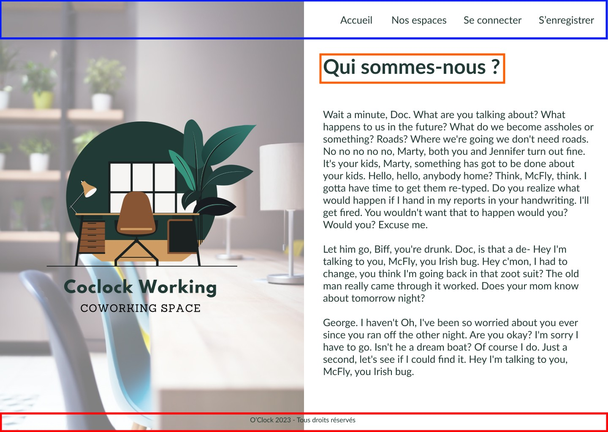
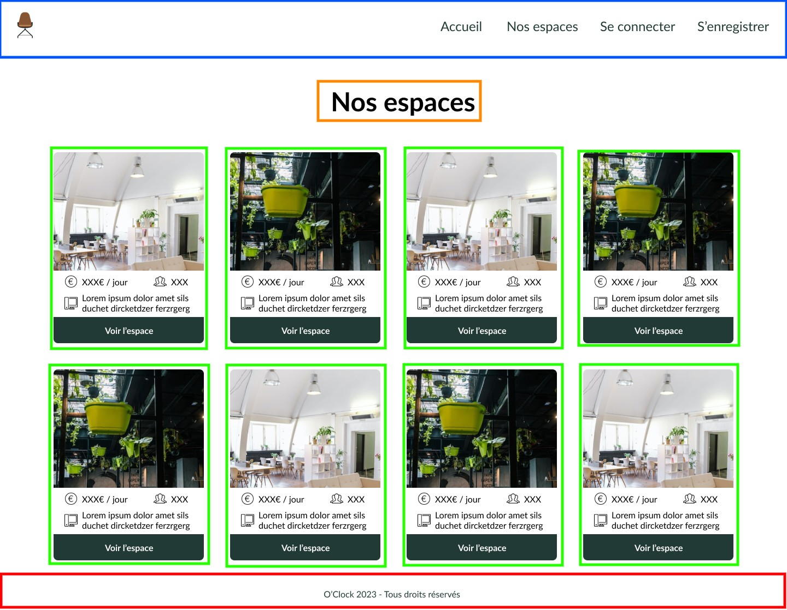

# Correction E10

---

## 1er atelier - On trace pour devenir Svelte

> :bulb: Il est toujours intéressant de percevoir les composants comme des éléments réutilisables à plusieurs endroits de notre code ou pour gérer d'une manière spécifique les éléments d'une page.

Proposition d'une découpe de maquette :

### Home page



Composants potentiels :

- Header
- main\_\_title
- Footer

---

### Login page


- Header
- main\_\_title
- formulaire
- inputs
- button
- Footer

---

### Register page


- Header
- main\_\_title
- formulaire
- inputs
- button
- Footer

---

### Spaces page



- Header
- main\_\_title
- card
- footer

---

### Space page


- Header
- Top Section with title & link button
- main\_\_title
- formulaire
- Textarea
- button
- Options block
- Comment block
- Footer

## 2e atelier - Coclock Working Svelte

Pour rappel, les apprenants ont reçu un projet initialisé avec l'intégralité des pages de l'application et un système de routage intégré pour la navigation.

Documentation de svelte-spa-router : [Ici même](https://github.com/ItalyPaleAle/svelte-spa-router)

> :warning: Attention, ce routeur génère des routes préfixées par un /#/
> Exemple : localhost:5173/# => homepage
> Exemple : localhost:5173/#/login => page de login
> Explications ici : [documentation](https://github.com/ItalyPaleAle/svelte-spa-router#hash-based-routing)

### Étape 1 - On jette un oeil à notre projet

#### Arborescence du projet

```
- 📁 public (contient nos images)
- 📁 src (contient nos fichiers applicatifs)
  - 📁 pages (contient les composants représentant les pages de l'app)
    - 📄 Homepage.svelte
    - 📄 Login.svelte
    - ...
  - 📁 style (contient nos fichiers de style)
    - 📁 base
    - 📁 components
    - 📁 layout
    - 📁 pages
    - 📁 utils
    - 📄 main.scss (fichier de style principal de l'app)
    - ...
  - 📄App.svelte (composant de base de l'app, comprend le routeur)
  - main.js (script principal de l'app, permet la jonction entre les fichiers `/src` et `index.html`)
  - 📄 routes.js (dictionnaire des routes de notre app)
- ⚙️ .gitignore
- 📄 index.html (point d'entrée de notre app)
- ⚙️ jsconfig.json (fichier config JavaScript)
- ⚙️ package.json (liste des dépendances nécessaires au projet)
- 📄 README.md
- ⚙️ svelte.config.js (fichier config svelte)
- ⚙️ vite.config.js (fichier config Vite)
```

On peut expliquer les bases du routeur, mais il ne sera pas nécessaire d'y toucher, celui-ci fonctionnant de base et les liens sont tous intégrés.

### Étape 2 - Remettre l'image au milieu du village

> :bulb: À noter ici que tous les fichiers se trouvent dans un dossier `public` Svelte cherche naturellement chaque asset dans ce dossier. Il suffit de mettre le chemin relatif pour faire le lien avec un asset, exemple : "/images/mon-image.jpg". Pratique :sunglasses:

`pages/_home.scss`

```scss
/* La classe homepage est définie sur body
   au cas où notre page est celle
   de l'accueil */
.homepage {
  /* Tout le texte est en blanc */
  color: $light;

  background: linear-gradient(to bottom, rgba(255, 255, 255, 0.4), $primary),
    url("/images/homepage-background.jpg") center/cover no-repeat; // L'adresse corrigée ✅
}
```

```scss
/* -- DESKTOP -- */
@include mixins.desktop {
  /* -- PARTIE GAUCHE -- */
  &__left-side {
    height: 100vh;
    background: linear-gradient(
        to bottom,
        rgba(255, 255, 255, 0.4),
        rgba(255, 255, 255, 0.6)
      ), url("/images/homepage-background.jpg") center/cover; // L'adresse corrigée ✅
    position: fixed;
    top: 0;
    left: 0;
    z-index: -1;
  }
}
```

`Space.svelte`

```html
<!-- Informations sur la salle -->
<section class="space-information">
  <ul class="space-information-list">
    <li class="space-information-list__elt">
      <!-- Aadresse icone corrigée ✅ -->

      <span>100€ / jour</span>
    </li>
    <li class="space-information-list__elt">
      <!-- Aadresse icone corrigée ✅ -->

      <span
        >50</span
      >
    </li>
    <li class="space-information-list__elt">
      <!-- Aadresse icone corrigée ✅ -->

      <span
        >Borne Wi-Fi, projecteur sans-fil</span
      >
    </li>
  </ul>
</section>
```

### Étape 3 - Composition

> :warning: On rappelle aux apprenants qu'il est important de créer un nouveau dossier `/src/components` afin de ranger nos composants.

1. On débute par la décomposition de nos pages. Chaque page contient un `header` et un `footer`. On crée les composants puis on appelle ces composants dans `App.svelte` pour entourer notre router.

```jsx
<Header />
// Le composant Router sert à afficher nos pages
<Router {routes} />
<Footer />
```

2. On crée un nouveau fichier `src/components/ThemeCard.svelte` dans lequel on vient recopier une itération d'une carte présente dans notre page `Spaces.svelte`. On fait ensuite l'import de ce nouveau composant et on remplace les occurences de nos cartes par une itération du composant.

`ThemeCard.svelte`

```html
<!-- Carte d'un espace -->
<article class="main__space theme-card">
  <div class="theme-card__informations">
    <ul class="theme-card__infos-list">
      <li class="theme-card__infos-elt">
        <span>100€ / jour</span>
      </li>
      <li class="theme-card__infos-elt">
        <span>10</span>
      </li>
      <li class="theme-card__infos-elt">
        <span> 2 écrans,2 projecteurs, 2 micros, 2 casques audio </span>
      </li>
    </ul>
  </div>
  <a
    href="#/spaces/1"
    class="theme-card__button"
    aria-label="Accéder à l'espace de coworking"
    >Voir l'espace</a
  >
</article>
```

`Spaces.svelte`

```html
<script>
  import ThemeCard from "~/components/ThemeCard.svelte";
</script>

<!-- Corps de la page -->
<main class="main">
  <!-- Titre de la page -->
  <h1 class="main__title">Nos espaces</h1>

  <!-- Contient nos cartes représentant un espace -->
  <section class="main__spaces-grid" aria-label="Espaces de coworking">
    <ThemeCard />
    <ThemeCard />
    <ThemeCard />
    <ThemeCard />
    <ThemeCard />
    <ThemeCard />
    <ThemeCard />
    <ThemeCard />
  </section>
</main>
```

Stat : Notre page `Spaces.svelte` passe de presque 300 lignes à 25 🔬, on gagne en clarté et en lisibilité. :tada:

### Étape 4 - Dynamisons 🧨

1. Dans une premier temps, créons un tableau d'objets regroupant la liste des informations que l'on peut récupérer sur un espace :

```js
const spacesData = [
  {
    id: 1,
    price: 50,
    capacity: "10",
    equipments: "Wi-Fi, projecteur",
    url: "#/spaces/1",
  },
  // etc...
];
```

Vous avez deux manières de placer ce tableau :

- Soit vous le mettez dans les `<script>` en haut de votre fichier `Spaces.svelte` (mais cela va ajouter plein d'infos dedans) 🤷‍♀️
- Soit, à l'instar de notre fichier `routes.js`, on crée un fichier `spacesData.js` qui va exporter par défaut un tableau d'objets que l'on va importer dans `Spaces.svelte`. L'information est donc bien rangée à un seul et même endroit et c'est plutôt sympa. :sunglasses: (on va utiliser cette méthode dans la suite).

`spacesData.js`

```js
export default [
  {
    id: 1,
    price: 50,
    capacity: "10",
    equipments: "Wi-Fi, projecteur",
    url: "#/spaces/1",
  },
  // ...
];
```

`ThemeCard.svelte`

```html
<script>
  // Ici, on déclare chacune des props dont on a besoin
  // On ajoute le mot-clé export qui sera utile pour lier
  // les props déclarées ici lorsqu'on fera appel à elles
  export let price, capacity, equipments, url;

  // Autre façon de faire, plus longue
  // export let price;
  // export let capacity;
  // export let equipments;
  // export let url;
</script>

<!-- Carte d'un espace -->
<article class="main__space theme-card">
  <div class="theme-card__informations">
    <ul class="theme-card__infos-list">
      <li class="theme-card__infos-elt">
        <!-- On ajoute nos props entre accolades aux endroits où on veut les voir apparaître -->
        {price} €<span />
      </li>
      <li class="theme-card__infos-elt">
        <span
          >{capacity}</span
        >
      </li>
      <li class="theme-card__infos-elt">
        <span>{equipments}</span>
      </li>
    </ul>
  </div>
  <a
    href="{url}"
    class="theme-card__button"
    aria-label="Accéder à l'espace de coworking"
    >Voir l'espace</a
  >
</article>
```

`Spaces.svelte`

```html
<script>
  import ThemeCard from "~/components/ThemeCard.svelte";

  // Tableau comprenant nos informations d'espaces
  import spacesData from "~/spacesData";
</script>

<!-- Corps de la page -->
<main>
  <!-- Titre de la page -->
  <h1>Nos espaces</h1>

  <!-- Contient nos cartes représentant un espace -->
  <section class="spaces-grid" aria-label="Espaces de coworking">
    <!-- Ici, on utilise #each pour boucler sur notre propriété stockée -->
    <!-- dans le store de l'application -->
    {#each spacesData as space} <ThemeCard price={space.price}
    capacity={space.size} equipments={space.equipments} url={"/spaces/" +
    space.id} picture={space.picture} /> {/each}
  </section>
</main>
```

### ⭐ BONUS ⭐

Comme dit dans l'énoncé, il va falloir récupérer des images pour les appliquer à nos backgrounds de cartes. Le problème ici réside dans le fait qu'il n'est pas possible de lier une propriété à une règle CSS, que ce soit d'un fichier `.svelte` vers un fichier `.scss` ou à l'intérieur d'un fichier `.svelte` dans une balise `<style>`

Heureusement, on a un autre moyen de faire cela. Ici, on va partir avec l'outil [lorem picsum](https://picsum.photos/) pour récupérer des images différentes pour chacune de nos cartes.

> :bulb: Rassurer sur le fait qu'en récupérant des images en local fonctionne aussi très bien. Le but ici est que nos espaces seront renseignées plus tard en BDD, lien vers l'image compris.

1. D'abord, on va mettre à jour chaque objet de notre tableau `spacesData.js` en ajoutant une propriété `picture` :

```js
export default [
  {
    id: 1,
    price: 50,
    capacity: "10",
    equipments: "Wi-Fi, projecteur",
    url: "#/spaces/1",
    picture: "https://picsum.photos/id/1060/850.webp", // Ici même
  },
  // ...
];
```

2. Ensuite, on va aller dans notre fichier `ThemeCard.svelte` pour créer notre propriété et ajouter la règle CSS directement à l'endroit nécessaire :

```html
<script>
  export let price, capacity, equipments, url, picture;
</script>

<!-- On ajoute l'attribut `style` et on reprend notre règle css déclarée dans `style.scss`  pour l'appliquer directement. On ajoute ensuite dans `url()` notre prop (entre accolade) -->
<article
  class="main__space theme-card"
  style="background: url({picture}) center/cover no-repeat"
>
  <div class="theme-card__informations">
    <ul class="theme-card__infos-list">
      <li class="theme-card__infos-elt">
        {price} €<span />
      </li>
      <li class="theme-card__infos-elt">
        <span
          >{capacity}</span
        >
      </li>
      <li class="theme-card__infos-elt">
        <span>{equipments}</span>
      </li>
    </ul>
  </div>
  <a
    href="{url}"
    class="theme-card__button"
    aria-label="Accéder à l'espace de coworking"
    >Voir l'espace</a
  >
</article>
```

`Spaces.svelte`

```jsx
<!-- Contient nos cartes représentant un espace -->
  <section class="main__spaces-grid" aria-label="Espaces de coworking">
    {#each spacesData as space}
    // On oublie pas de lier notre prop 'picture' et la donnée qui va avec 'space.picture'
      <ThemeCard
        price={space.price}
        capacity={space.capacity}
        equipments={space.equipments}
        url={space.url}
        picture={space.picture}
      />
    {/each}
  </section>
```

Et voilà ! :tada:
